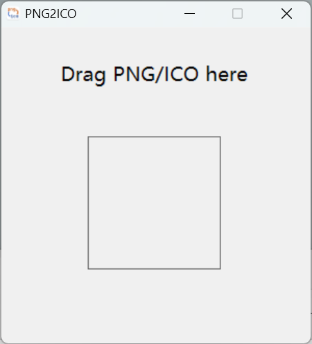

## Introduction
The png2ico is a simple tool for converting png file to ico file or ico file to png file. 
As a GUI tool created by python with PySide6 and package with nuitka, the file size of the 
executable file is big.

## Usage
Download the executable file in releases, and run it, then drag png file or ico file to the square,
then the converted file will be stored in the same folder with the input file.  
